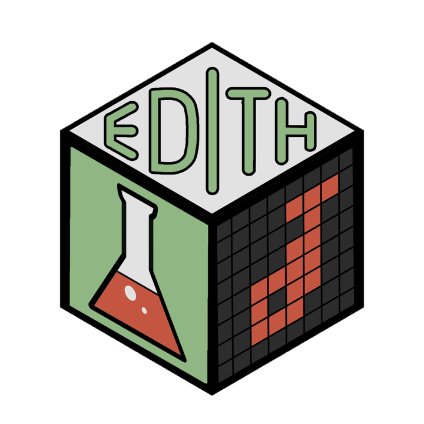

# **EDITH** 
### **Evaluation of Drug Interactions in the setting of THerapy combinations** 

<br>

🔎 More details here: https://mathilde-robin.github.io/EDITH/

#### 🎯 **Motivations**

The `EDITH` package enables the synergistic effects of two or three drugs to be explored,
based on cell viability data obtained from combination experiments. 

#### ⚙️ **Installation**

```r
if (!requireNamespace("devtools", quietly = TRUE)) {
    install.packages("devtools")
}

if (!requireNamespace("ComplexHeatmap", quietly = TRUE)) {
    if (!requireNamespace("BiocManager", quietly = TRUE)) {
        install.packages("BiocManager")
    }
    BiocManager::install("ComplexHeatmap")
}

devtools::install_github("mathilde-robin/EDITH")
```

#### 📊 **Input for `EDITH`**

EDITH can explore the synergistic effects of two or three drugs based on cell 
viability data obtained from combination experiments. The input data should be
provided in a specific format, as described in the package documentation. 
Example datasets are included in the package to illustrate the required format
(`inst/extdata/2drugs.xlsx` and `inst/extdata/3drugs.xlsx`).

Here a snapshot of the input data format for two drugs:

**FIGURE**

#### 🚀 **Usage**

`EDITH` is a all-in-one function that performs the entire analysis pipeline, 
from data preprocessing to visualization of results. The `run_EDITH()` function
detects whether the input data corresponds to a two-drug or three-drug combination
and applies the appropriate analysis methods accordingly. The input file path is
specified via a pop-up window when the function is executed.

```r
library(EDITH)
run_EDITH()
``` 

#### 🎉 **Output**

The main outputs of the `EDITH` package include:

- Heatmaps visualizing the viability data across different drug concentration combinations,
- Heatmaps visualizing the expected viability based on the Bliss independence model,
- Heatmaps visualizing the interaction effect,
- Summary tables detailing the additive, combination and efficacy indexes.

Here are example heatmaps generated by `EDITH` for two-drug combinations:

**FIGURE**

#### 🔗 **Reference**

The full package documentation is available [here](https://mathilde-robin.github.io/EDITH/).

The initial development of this package was motivated by the work of 
[Tosi et al., BMC Cancer, 2018](https://link.springer.com/article/10.1186/s12885-018-4712-z).

#### 🧑‍💻 **Authors**

Mathilde Robin (mathilde.robin@inserm.fr), Raphaël Romero (raphael.romero@inserm.fr), Diego Tosi (diego.tosi@icm.unicancer.fr)

#### 📜 **Citation**

Tosi D, Robin M, Romero R (2025). *EDITH: Evaluation of Drug Interactions in the setting of THerapy combinations*. R package version 0.1.0.

```
@Manual{,
  title = {EDITH: Evaluation of Drug Interactions in the setting of THerapy combinations},
  author = {Mathilde Robin, Raphaël Romero, Diego Tosi},
  year = {2025},
  note = {R package version 0.1.0},
  url = {https://mathilde-robin.github.io/EDITH/}
}
``` 

#### ⚖️ **Licence**

Copyright (c) 2025 EDITH authors

Permission is hereby granted, free of charge, to any person obtaining a copy of this software and associated documentation files (the “Software”), to deal in the Software without restriction, including without limitation the rights to use, copy, modify, merge, publish, distribute, sublicense, and/or sell copies of the Software, and to permit persons to whom the Software is furnished to do so, subject to the following conditions:

The above copyright notice and this permission notice shall be included in all copies or substantial portions of the Software.

THE SOFTWARE IS PROVIDED “AS IS”, WITHOUT WARRANTY OF ANY KIND, EXPRESS OR IMPLIED, INCLUDING BUT NOT LIMITED TO THE WARRANTIES OF MERCHANTABILITY, FITNESS FOR A PARTICULAR PURPOSE AND NONINFRINGEMENT. IN NO EVENT SHALL THE AUTHORS OR COPYRIGHT HOLDERS BE LIABLE FOR ANY CLAIM, DAMAGES OR OTHER LIABILITY, WHETHER IN AN ACTION OF CONTRACT, TORT OR OTHERWISE, ARISING FROM, OUT OF OR IN CONNECTION WITH THE SOFTWARE OR THE USE OR OTHER DEALINGS IN THE SOFTWARE.
