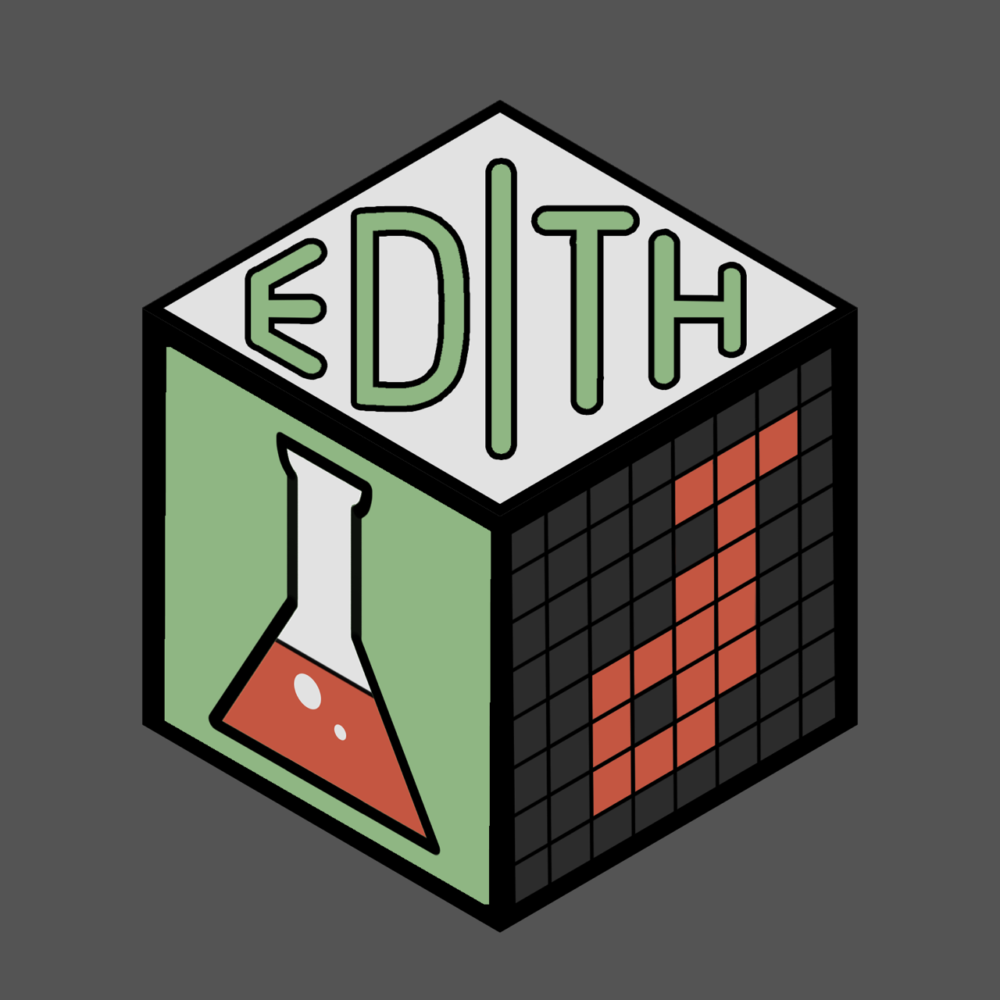

# **EDITH** 
### **Evaluation of Drug Interactions in the setting of THerapy combinations** 

<br>

#### 🎯 **Motivations**


#### ⚙️ **Installation**

```r
if (!requireNamespace("devtools", quietly = TRUE)) {
    install.packages("devtools")
}

if (!requireNamespace("ComplexHeatmap", quietly = TRUE)) {
    if (!requireNamespace("BiocManager", quietly = TRUE)) {
        install.packages("BiocManager")
    }
    BiocManager::install("ComplexHeatmap")
}

devtools::install_github("mathilde-robin/EDITH")
library(EDITH)
```

#### 📊 **Input for Edith**

#### 🚀 **Usage**

```r
run_EDITH()
``` 

#### 🎉 **Output**

#### 🔗 **Reference**

The full package documentation is available at: 

#### 🧑‍💻 **Authors**

Mathilde Robin (mathilde.robin@inserm.fr), Raphaël Romero (raphael.romero@inserm.fr), Diego Tosi (diego.tosi@icm.unicancer.fr)
