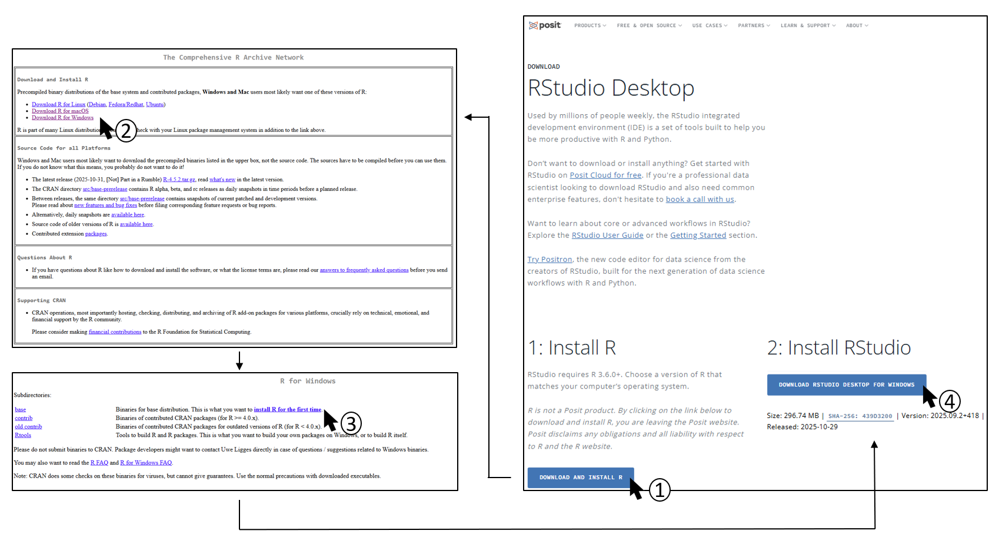

# Installation

  

## 💻 **R and RStudio installation**

To use the `EDITH` package, you first need to install R and RStudio on
your computer. You can directly go on the posit.co website
(<https://posit.co/downloads/>) and follow the instructions:



  

## 📦 **Package installation**

You can know open RStudio and install the `EDITH` package by running the
following code. You can just copy-paste it into the RStudio console and
hit `Enter`.

``` r
if (!requireNamespace("remotes", quietly = TRUE)) {
    install.packages("remotes")
}

if (!requireNamespace("ComplexHeatmap", quietly = TRUE)) {
    if (!requireNamespace("BiocManager", quietly = TRUE)) {
        install.packages("BiocManager")
    }
    BiocManager::install("ComplexHeatmap")
}

remotes::install_github("mathilde-robin/EDITH")
```

Once the installation is complete, you can load the package by running:

``` r
library(EDITH)
```

🎉 If you don’t see any error, you are now ready to use the `EDITH`
package!

  

🔎 For more information on how to use it, please refer to the vignettes:

- for two drugs:
  <https://mathilde-robin.github.io/EDITH/articles/two_drugs.html>
- for three drugs:
  <https://mathilde-robin.github.io/EDITH/articles/three_drugs.html>
