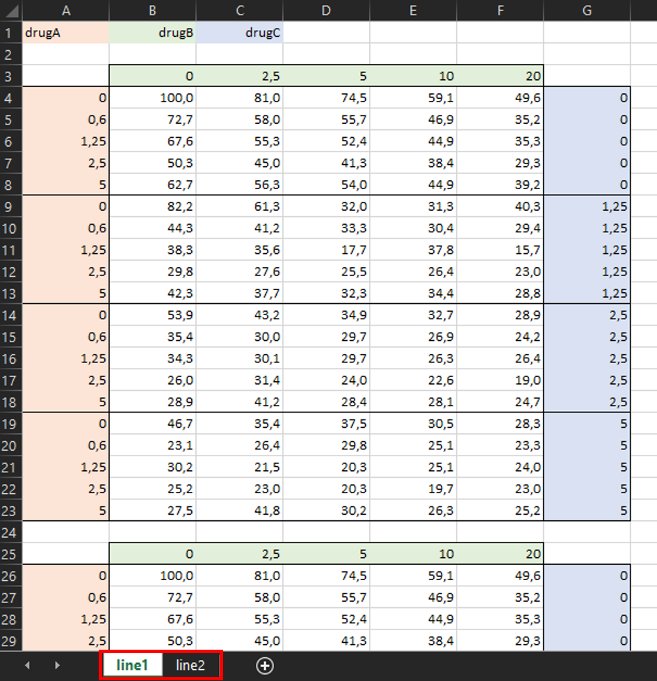

# Tutorial with 3 drugs

  

## 📊 **Input for `EDITH`**

To use the `EDITH` package, you need to provide an input file in `.xlsx`
format. This file should contain the dose-response data for two drugs.
You can find an example of such a file in the `extdata` folder of the
package, or found the complete path by running the following code:

``` r
list.files(
  path = system.file("extdata", package = "EDITH"), 
  pattern = ".xlsx", full.names = TRUE
)
```

    ## [1] "/home/runner/work/_temp/Library/EDITH/extdata/2drugs.xlsx"
    ## [2] "/home/runner/work/_temp/Library/EDITH/extdata/3drugs.xlsx"

Otherwise, you can have a look at the snapshot of the example input file
below:


  

🔥 **The criteria for the input file are as follows:**

- The file must be in `.xlsx` format.
- The first cell (`A1`) must contain the name of the drug in the rows
  (e.g., “Drug A”).
- The second cell (`B1`) must contain the name of the drug in the
  columns (e.g., “Drug B”).
- The third cell (`C1`) must contain the name of the drug in the layers
  (e.g., “Drug C”).
- The second row must be empty.
- The third row must contain the concentrations of Drug B (starting from
  cell `B3`).
- The first column must contain the concentrations of Drug A (starting
  from cell `A4`).
- The last column must contain the concentrations of Drug C by block.
- The drugs concentrations must be in increasing order, starting from
  zero (0) for no drug and with a consistent step size.
- The rest of the cells must contain the corresponding viability values
  between 0 and 100 (values higher than 100 will be set to 100).

💡 **Note**: If you have multiple replicates for the same experiment
(ie. with exactly the same drugs and doses), you can add them in the
same sheet, just below the first experiment, with one empty row in
between.

💡 **Note**: If you have multiple experiments, you can add them in
additional sheets of the same file, with the same format. The name of
each sheet will be used as the name of the output files.



  

## 🚀 **Run `EDITH`**

[`run_EDITH()`](../reference/run_EDITH.md) is a all-in-one function that
performs the entire analysis pipeline, from data preprocessing to
visualization of results. After loading the `EDITH` package, you can run
the function by copy-pasting the following code into the RStudio console
and hitting `Enter`:

``` r
library(EDITH)
run_EDITH()
```

Then, you can select the input file you want to analyze via a pop-up
window:


After selecting the file, the function will automatically process the
data, perform the analysis, and generate the output files in the
designated output folder.

💡 **Note**: You don’t need to create the output folder. It will be
created automatically when running the functions. It will be create in
the same directory as your input file, with the same name as your input
file followed by `_output/`.

  

## 🎉 **Output**

After running the [`run_EDITH()`](../reference/run_EDITH.md) function,
you will find the output files in the output directory created
automatically. Here is an example of the output directory structure for
a input file with 1 experiment (ie. 1 excel sheet `line1`), with 2
replicates:


  

In the three drugs version of `EDITH`, for each experiment and each
replicate, the analysis is performed for all the 3 possible drug
permutations:

- Perm 1: drug B in the x-axis, drug A in the y-axis, drug C is varying.
- Perm 2: drug C in the x-axis, drug B in the y-axis, drug A is varying.
- Perm 3: drug A in the x-axis, drug C in the y-axis, drug B is varying.

  

Finaly, for each experiment, each replicate and each drug permutation,
you obtain:

1.  One `.pdf` file with three pages per concentration of the third
    drug, containing:

- A heatmap visualizing the viability data across different drug
  concentration combinations,
- A heatmap visualizing the expected viability based on the Bliss
  independence model,
- A heatmap visualizing the interaction effect for each concentration of
  the third drug.

2.  One `.pdf` file with the viability and interaction heatmaps for each
    concentration of the third drug in an unique file.


3.  One `.xlsx` file detailing the additive, combination and efficacy
    indexes for each concentration of the third drug.


  

🔎 Fore more details about the method, please refer to the theory
vignette: <https://mathilde-robin.github.io/EDITH/articles/theory.html>
