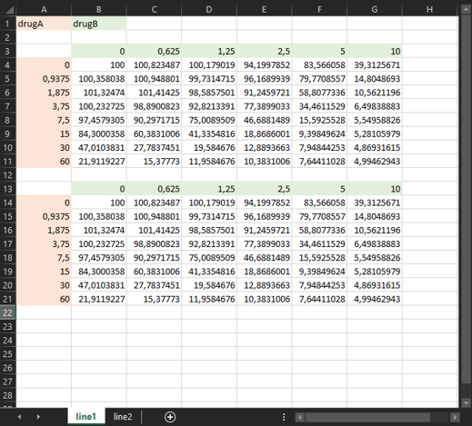
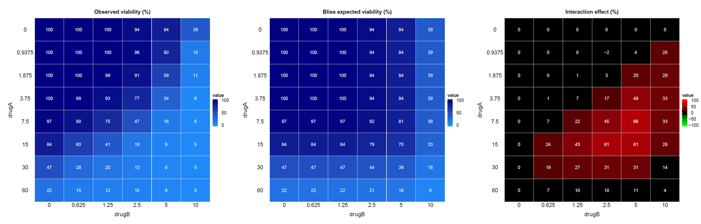

# **EDITH** - Evaluation of Drug Interactions in the setting of THerapy combinations

  

#### 🔗 **Reference**

🔎 The full package documentation is available here:
<https://mathilde-robin.github.io/EDITH/>.

🌱 The initial development of this package was motivated by the work of
[Tosi et al., BMC Cancer,
2018](https://link.springer.com/article/10.1186/s12885-018-4712-z).

  

#### 🎯 **Motivations**

The `EDITH` package enables the synergistic effects of two or three
drugs to be explored, based on cell viability data obtained from
combination experiments.

  

#### ⚙️ **Installation**

``` r
if (!requireNamespace("devtools", quietly = TRUE)) {
    install.packages("devtools")
}

if (!requireNamespace("ComplexHeatmap", quietly = TRUE)) {
    if (!requireNamespace("BiocManager", quietly = TRUE)) {
        install.packages("BiocManager")
    }
    BiocManager::install("ComplexHeatmap")
}

devtools::install_github("mathilde-robin/EDITH")
```

🔎 More details in the installation vignette:
<https://mathilde-robin.github.io/EDITH/articles/install.html>

  

#### 📊 **Input for `EDITH`**

EDITH can explore the synergistic effects of two or three drugs based on
cell viability data obtained from combination experiments. The input
data should be provided in a specific format, as described in the
package documentation. Example datasets are included in the package to
illustrate the required format (`inst/extdata/2drugs.xlsx` and
`inst/extdata/3drugs.xlsx`) and can be found with this command:

``` r
list.files(path = system.file("extdata", package = "EDITH"), full.names = TRUE)
```

Here a snapshot of the input data format (in a excel file) for two
drugs:



🔎 More details in the vignettes:

- for two drugs:
  <https://mathilde-robin.github.io/EDITH/articles/two_drugs.html>
- for three drugs:
  <https://mathilde-robin.github.io/EDITH/articles/three_drugs.html>

  

#### 🚀 **Usage**

`EDITH` is a all-in-one function that performs the entire analysis
pipeline, from data preprocessing to visualization of results. The
[`run_EDITH()`](reference/run_EDITH.md) function detects whether the
input data corresponds to a two-drug or three-drug combination and
applies the appropriate analysis methods accordingly. The input file
path is specified via a pop-up window when the function is executed.

``` r
library(EDITH)
run_EDITH()
```

  

#### 🎉 **Output**

The main outputs of the `EDITH` package include:

- Heatmaps visualizing the viability data across different drug
  concentration combinations,
- Heatmaps visualizing the expected viability based on the Bliss
  independence model,
- Heatmaps visualizing the interaction effect,
- Summary tables detailing the additive, combination and efficacy
  indexes.

Here are example heatmaps generated by `EDITH` for two-drug
combinations:


