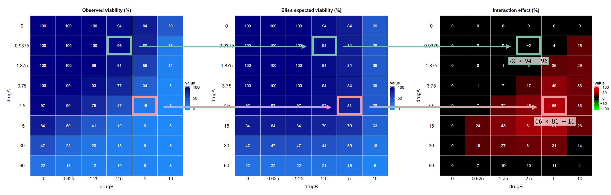

```{r setup, include=FALSE}
knitr::opts_chunk$set(echo = TRUE)
```

<br>

## 🎯 **Aim**

Characterizing interactions between drugs is an area of major interest for drug  
development, as exploiting synergism between drugs could allow increasing  treatment 
efficacy using lower doses of single drugs, and avoiding antagonistic  interaction 
is needed to maintain the therapeutic efficacy of drugs. Broadly speaking,
synergism and antagonism could be defined as an increase or a reduction of the
effect of a drug combination compared to the effect expected for the combination 
on  the basis of the single agent effects.

The `EDITH` package enables the synergistic effects of two or three drugs to be explored,
based on cell viability data obtained from combination experiments. The package 
is designed to analyze and visualize drug interactions and implements a widely 
used method for assessing drug interactions: *the Bliss independence model*.

<br>

## 📐 **Bliss independence model**

The Bliss independence model is a mathematical framework used to evaluate the independence
(ie. the absence of any interaction effect) of two drugs when they are administered 
in combination. The  general form of Bliss independence model is the following equation:

$$E_{combined} = E_A + E_B - (E_A \cdot E_B)$$
where:

- $E_A$ is the effect of drug A,
- $E_B$ is the effect of drug B,
- $E_{combined}$ is the expected effect of the drug combination.

In the case of a cancer cell population, the effect will correspond to the fraction of
cells killed by the drug(s). For example, if drug A kills 30% of the cells, $E_A = 0.3$ and 
drug B kills 40% of the cells $E_B = 0.4$. According to the Bliss independence model, 
the expected effect of the combination of drugs A and B would be: 
$$E_{combined} = 0.3 + 0.4 - (0.3 \times 0.4) = 0.58$$
This means that the combination of drugs A and B is expected to kill 58% of the 
cells if they act independently.

The Bliss equation can be recast in terms of unaffected cells as follows:

$$U_{combined} = U_A \cdot U_B$$

where:

- $U_A$ is the fraction of unaffected cells by drug A (ie. viability after treatment with drug A),
- $U_B$ is the fraction of unaffected cells by drug B (ie. viability after treatment with drug B),
- $U_{combined}$ is the expected fraction of unaffected cells by the drug combination.

For example, if drug A leaves 70% of the cells unaffected, $U_A = 0.7$ and drug B 
leaves 60% of the cells unaffected $U_B = 0.6$. According to the Bliss independence model, 
the expected fraction of unaffected cells by the combination of drugs A and B would be:

$$U_{combined} = 0.7 \times 0.6 = 0.42$$
This means that the combination of drugs A and B is expected to leave 42% of the cells 
unaffected if they act independently.

The generalized form of the Bliss equation for a combination of n drugs is:

$$U_{combined} = \prod_{i=1}^n U_i$$

where:

- $i = 1, ..., n$ indexes the drugs in the combination,
- $U_i$ is the fraction of unaffected cells by drug $i$.

🚨 **Important**: The values in the input matrix must correspond to the percentage of living cells.

<br>

## 👀 ️**Visual example**

To illustrate the Bliss independence model, consider the following example with two drugs, A and B:

<p align="center">
  
</p>

<br>

## 🔍 **Evaluation of drug interactions**

To evaluate the interaction between drugs, the observed effect of the drug combination 
is compared to the expected effect calculated using the Bliss independence model.
This is simply done by subtracting the observed effect from the expected effect:

$$Interaction = U_{expected} - U_{observed}$$

<br>

## 🧩 **Interpretation**:

The interaction can be classified into three categories based on this comparison:

- ⚡ **Synergy**:More cells killed than expected → positive interaction effect ($U_{expected} - U_{observed}$)
- ⚖️ **Additivity**: As many cells killed as expected → no interaction effect ($U_{expected} ≈ U_{observed}$)
- ⚔️ **Antagonism**: Less cells killed than expected → negative interaction effect ($U_{expected} > U_{observed}$)

<br>

## 👀 ️**Visual example**

To illustrate the interaction estimation, consider the following example with two drugs, A and B:

<p align="center">
  
</p>

<br>

## 🧮 **Quantification of drug interactions**

In addition to this point-bypoint estimation, different measures can be used to 
quantify drug interactions. In the `EDITH` package, we implement three different 
indexes: the additive index, the combination index and the efficacy index.

🚨 **Important**: These indexes can be used **if and only if** the dilution factor 
is fixed between all the dose levels for each drug used in the cytotocixity assay.

🚨 **Important**: These indexes can be used to compared different experiments **if and only if**
the same drug concentration ranges and the same dilution factors are used in all experiments.

<br>

### 🌟 **Combination index**

According to the approach proposed by Lehár (Lehár et al., 2007, 2008, 2009), 
the **combination index**, is calculated as follows:

$$CI = \ln f_A \cdot \ln f_B \cdot \sum_{A,B} (U_{expected} - U_{observed})$$

where:

- $f_A$ and $f_B$ are the dilution factors used in the cytotocixity assay for drugs A and B respectively,
- $U_{observed}$ and $U_{expected}$ are the matrices of the survival percentage for the experimental data and for the corresponding Bliss independence data, respectively.

The generalized form of the equation for a combination of $n$ drugs is:

$$CI = \prod_{i=1}^n \ln f_i \cdot \sum_{i=1}^n (U_{expected} - U_{observed})_i$$

where:

- $f_i$ is the dilution factor used in the cytotoxicity assay for drug $i$,
- $U_{observed}$ and $U_{expected}$ are the matrices of the survival percentage for the experimental data and for the corresponding Bliss independence data, respectively.

🧩 **Interpretation**: The higher the combination index, the more synergistic the drugs are.

<br>

### 🌟 **Efficacy index**

An **efficacy index** is calculated as follow: 

$$EI = \ln f_A \cdot \ln f_B \cdot \sum_{A,B} (100 - U_{observed})$$ 

where:

- $f_A$ and $f_B$ are the dilution factors used in the cytotocixity assay for drugs A and B respectively,
- $U_{observed}$ is the matrix of the survival percentage for the experimental data.

The generalized form of the equation for a combination of $n$ drugs is:

$$EI = \prod_{i=1}^n \ln f_i \cdot \sum_{i=1}^n (100 - U_{observed})_i$$

where:

- $f_i$ is the dilution factor used in the cytotoxicity assay for drug $i$,
- $U_{observed}$ is the matrix of the survival percentage for the experimental data.

🧩 **Interpretation**: The higher the efficacy index, the more lethal the drugs are.

<br>

### 🌟 **Additivity index**

An **additivity index** is calculated as follow:

$$AI = \ln f_A \cdot \ln f_B \cdot \sum_{A,B} (100 - U_{expected})$$

where:

- $f_A$ and $f_B$ are the dilution factors used in the cytotocixity assay for drugs A and B respectively,
- $U_{expected}$ is the matrix of the survival percentage for the corresponding Bliss independence data.

The generalized form of the equation for a combination of $n$ drugs is:

$$AI = \prod_{i=1}^n \ln f_i \cdot \sum_{i=1}^n (100 - U_{expected})_i$$

where:

- $f_i$ is the dilution factor used in the cytotoxicity assay for drug $i$,
- $U_{expected}$ is the matrix of the survival percentage for the corresponding Bliss independence data.

🧩 **Interpretation**: The higher the additivity index, the more lethal the drugs 
are supposed to be according to the Bliss independance model.

